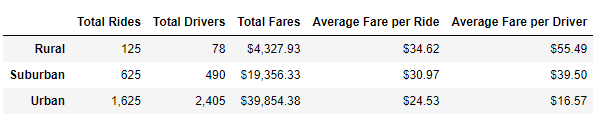

# PyBer_Analysis

## Overview of the Analysis
Using city data and ride data, and using groupby techniques, I created a summary per city type that includes total rides, total drivers, total fares, and averages of fares per ride and per driver.
After creating the summary for city type, I created new dataframes to focus on rides in these city types from January to April in 2019. I did this using pivot and calling the specific dates I had in mind. Then I resampled the data to reset the index to look at it week over week so that I can chart that on a line chart that includes all three city types during that time frame.

## Results
**For the first section where I created a summary, I obtained the following results:**

 

The city types were rural, suburban, and urban. 

For rural, there were 125 for 78 drivers. For suburban there were 625 rides for the 490 drivers. For urban there were 1,625 for 2,405 drivers. In rural there are more rides than drivers, but as we go to urban there are more drivers than rides. 

For total fares, rural isn't bringing in much with fares are $4,327.93. Suburban is bringing in significantly more are $19,356.33 and urban brought it $39,854.38. 

The average fare per ride for rural was $34.62, while the average fare per ride for suburban was $30.97. Urban was even less for the average fare per ride at $24.53.

The last item calculated was average fare per driver. For rural a driver brought in, on average, $55.49. A suburban driver brought it an average of $39.50 and an urban driver brought int $16.57.

**For the second section I plotted week over week of total fare per city type as seen below**

 

Overall, urban brings in more in total fare week over week when compared to suburban and rural. There was a peak just before March for all three cities, and then a dip right after that peak. 
Urban cities started off lower in total fare in Janary and then began oscilating between peaks and valleys week over week just around March where it steadied around April. Suburban experienced steadier increases and decreases. Similar to urban, suburban started off with a lower total fare in January but did reach simlar quantities in March and the beginning of April before increasing. For rural, the total fare was not lower than the week after like it was for the other two city types. It actually dropped after instead of increasing the second week. Similar to urban, there were peaks and valleys oscilating week over week but the oscilation between the two were much less than in urban. There were peaks in February, just before March, and at the beginning of April.

## Summary

The data we have is limited. Rural rides are almost $35 but it is not understood why. Whether drivers are traveling greater distances or taking longer in time is unclear. If this data could be obtained (distance and total time of each ride) we would be able to see what is causing the disparity between rural rides and urban ride costs.

The other information that could be used is simple looking at a larger time frame. January to April is only a third of the year. There are holidays, summer vacations, etc. where these areas could be performing rather different because of said things.

The data also shows us that there are almost double the amount of rides than drivers in rural areas whereas there are more drivers than rides in urban areas. To address the disparity, Pyber could target recruiting more drivers in rural/suburban areas with incentives. Alternatively, Pyber could choose to provide more incentives to riders in urban areas to increase total rides.

The final item that could be done is market research as to why there are less rides in urban areas than rural areas. Find out why there are more drivers than riders. Because of how compact the city might be, perhaps more people walk because the price of the ride does not seem worth it. Alternatively in rural areas, locations might be much further so walking may not seem as lucrative for the rider and they may be willing to pay more. Perhaps in the city there is more competition of drivers like other ride programs, taxis, public transportation, etc. Doing market research would answer these questions to find out what approach can be taken.

